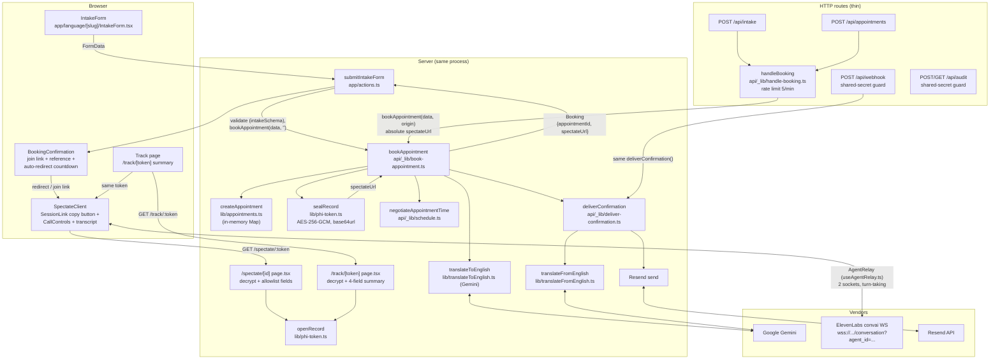

# Architecture

How a form submission becomes a booked appointment, a live demo call, and a
confirmation email. Code references are relative to the repo root.

## Pipeline diagram

## Booking pipeline: `actions.ts` → `book-appointment.ts` → `deliver-confirmation.ts`

The form posts to the `submitIntakeForm` server action
(`src/app/actions.ts`), not to an HTTP endpoint. The action validates with
`intakeSchema` first — client-side `required` attributes are bypassable — then
calls `bookAppointment(data, "")` directly. The empty origin means the
spectate URL comes back root-relative; the browser resolves it against the
origin it already trusts, so the flow works behind proxies and tunnels without
building a URL from the client-controlled `Host` header (that self-`fetch`
arrangement was removed).

`bookAppointment` (`src/app/api/_lib/book-appointment.ts`) is the single
implementation both entry points share:

1. `translateToEnglish` (Gemini) normalises the submission to English.
2. `createAppointment` stores the record in an in-memory `Map`
   (`src/lib/appointments.ts`) — lost on redeploy, not shared across
   serverless instances.
3. `sealRecord` encrypts the record into the spectate token; the URL is
   `${origin}/spectate/${token}`.
4. `negotiateAppointmentTime` (`src/app/api/_lib/schedule.ts`) simulates the
   clinic negotiating forward from the requested slot.
5. `deliverConfirmation` translates the hospital response back into the
   patient's language and sends it via Resend.

HTTP callers reach the same pipeline through `handleBooking`
(`src/app/api/_lib/handle-booking.ts`), which backs both
`POST /api/intake` and `POST /api/appointments`. It rate-limits (5/min per
caller, shared scope so the two URLs share one budget) and passes
`request.nextUrl.origin` so API-built spectate URLs are absolute.

Email failure is a partial success, not a silent one. `deliverConfirmation`
never throws — it returns `{ ok: false, reason }` — and `bookAppointment`
converts that into a `ConfirmationDeliveryError` carrying the booking. The
record already exists at that point, so both the server action and the route
handler hand the patient their link alongside the warning instead of claiming
the booking failed (which would invite a double booking on resubmit).

## Sealed PHI tokens: `phi-token.ts`

The spectate/track route segment is the encrypted record, not an id
(`src/lib/phi-token.ts`). Single-key AES-256-GCM over the layout
`version (1 byte) | iv (12) | authTag (16) | ciphertext`, base64url-encoded.
Opening needs `HIPAA_MASTER_KEY`, which never leaves the server, so the token
is opaque in browser history, `Referer` headers, and access logs — the old
`?patientInfo=` query-string URL put plaintext PHI in all of them.

`openRecord` collapses every failure (truncated, tampered, wrong key, wrong
version) to `null`, and callers must not distinguish them. The token is a
bearer credential: anyone holding it sees the appointment on a server holding
the key. It is deliberately transitional — unrevocable, unexpiring, as long as
the record — until durable storage lands and it can become a short id plus a
server-side lookup.

## Spectate relay: `useAgentRelay.ts` state machine

`/spectate/[id]/page.tsx` is a server component: it decrypts the token,
narrow-validates the record to the fields the page renders, and passes the
patient data plus the two agent ids (from server-side config, never hardcoded
in the client bundle) into `SpectateClient`.

`SpectateClient` drives the call through the `AgentRelay` class
(`src/hooks/useAgentRelay.ts`), a framework-free machine with a thin
`useSyncExternalStore` hook over it. Two vendor WebSockets
(`wss://api.elevenlabs.io/v1/convai/conversation?agent_id=…`) connect
concurrently — one per agent — and relay finished utterances to each other
after a short hold.

- Session phase: `idle → connecting → live`, with `degraded` (one side
  dropped, backoff reconnect running), `stopped` (deliberate end), and
  `failed` (a side never connected — fails the whole session, closes both
  sockets).
- Per-side socket status (`idle | connecting | open | reconnecting | closed |
  failed`) replaces the old single `isConnected` boolean that stayed true when
  one side died.
- Turn-taking is one `awaiting` record plus an outbox and three timers: a
  stream-idle timeout closes utterances whose final frame never arrives, a
  response timeout drops turns that are delivered but never answered, and a
  bounded send-retry outbox holds lines for a socket that is down. Every exit
  terminates — a lost turn can no longer wedge the relay silently.
- Reconnect re-briefs the agent with the last 4 transcript lines instead of
  the opening greeting, so the call resumes instead of restarting.

`SessionLink` (`src/components/spectate/SessionLink.tsx`) shows the session
URL with a **Copy link** button. It reads its own `location.href` and
deliberately never logs the URL: the route segment is a bearer credential to
the patient's appointment. This in-page button is the documented way to share
a session — no devtools, no console.

## Track page

`/track/[token]` is the patient's view of the same sealed record; the same
token opens both pages. It decrypts server-side and renders four fields —
department, date, requested time, language — while date of birth, contact
details, insurance, and symptom text stay off the page (the link is easy to
forward by accident). It links onward to `/spectate/[token]` for the live-call
demo. `/track` with no token explains that the link itself is the appointment:
there is nothing to search for. Both pages are `noindex` and force-dynamic so
a bearer URL is never indexed or cached.

## Webhook and audit routes

- `POST /api/webhook` keeps its shared-secret guard (`INTERNAL_API_SECRET`
  via `requireInternalSecret`) and calls the same `deliverConfirmation()`
  function the booking path uses in-process. Without the secret it would be an
  open mail relay. Delivery failures answer 502, not 400 — the request was
  well-formed; the upstream refused it. `GET` is liveness only.
- `/api/audit` (`POST`/`GET`) is guarded by the same secret: unauthenticated
  writes would let anyone forge entries, and the trail itself contains PHI in
  `details`. The log (`src/lib/audit.ts`) is an in-memory hash chain, so it
  resets to genesis on every restart and provides no durable tamper evidence.
